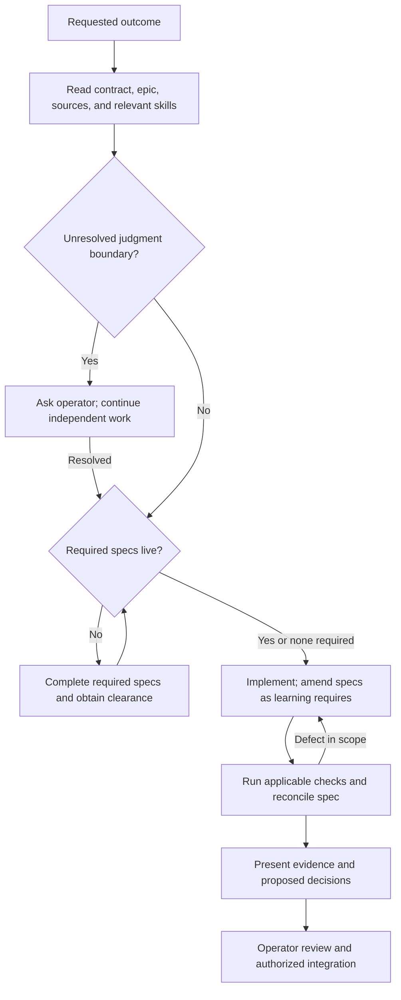

# Ways of working

The baseline assessment evaluates branch `feat/rc1-readiness` at commit `e1c6f9e7` on 2026-09-05.
GitHub lists no open pull requests. Local sibling feature branches comprise
`app-chrome-off-cyan`, `deprecate-cyan-and-qol`, `forms-and-feedback`, and
`reply-authoring`. The assessment leaves remote branch references unrefreshed.
The assessment treats uncommitted README, package-version, and document-deletion
changes as working-tree evidence rather than accepted release decisions.

The repository combines a portable instruction core with partial executable enforcement.
Conflicting instructions that govern the same decision create the principal operational
weakness. This assessment covers repository configuration and documented harness loading.
It does not establish equivalent behavior across four live agent runs.

## Expected conduct

| Decision | Expected agent action | Governing reference |
| --- | --- | --- |
| Establish scope. | Identify the requested outcome, active branch, existing edits, and relevant epic. Preserve work outside the request. | [Project contract](../AGENTS.md) |
| Start a task. | Establish that required governing specs are live before implementation begins. Distinguish starting readiness from amendments discovered during the task. | [Next-task skill](../.agents/skills/next-task/SKILL.md#check-readiness) |
| Change a migrated surface. | Inspect v18 logic and v20 presentation before editing. Ask the operator when source evidence cannot establish compatibility or intent. | [Project contract](../AGENTS.md#judgment-boundaries), [design intent](DESIGN.md) |
| Change design-system behavior. | Name an open epic and governing spec. Deliver implementation, consumer adoption, and the required book together. | [Developer skill](../.agents/skills/design-system-developer/SKILL.md), [architecture](ARCHITECTURE.md) |
| Amend a spec. | Continue work alongside a material `proposed` amendment and flag the amendment for operator clearance. Present a minor settled amendment as an unapplied diff and await acceptance. | [Spec skill](../.agents/skills/spec/SKILL.md) |
| Verify a change. | Select evidence for the active question and report actual results and omissions. | [Delivery gates](../delivery.yaml) |
| Cross a judgment boundary. | Obtain operator confirmation before modifying shared Firebase assets, departing from compatibility, executing destructive migrations, or changing release processes. Request explicit instructions before changing branches. | [Project contract](../AGENTS.md#judgment-boundaries) |
| Deliver work. | Reconcile the governing spec, report unresolved decisions, and perform authorized integration. Task completion alone does not authorize a commit or push. | [Spec sync](../.agents/skills/spec-sync/SKILL.md), [local Claude instructions](../CLAUDE.local.md)¹ |



## Skills and execution

| Work | Relevant skills | Execution distinction |
| --- | --- | --- |
| Define scope. | `epic-planning`, `next-task` | An epic defines outcomes. `next-task` selects the smallest complete benefit for users, developers, docs, or the harness and proposes it in roughly 10–15 lines of concrete technical detail. |
| Specify behavior. | `spec`, `spec-review`, `spec-sync` | The `spec-review` skill requires an independent critic. `spec-sync` reconciles implementation evidence through inline clearance for minor settled amendments or proposed amendments for material discoveries. |
| Build the design system. | `design-system-developer`, `design-system-tests`, `design-system-book` | Load the procedures for the target artifacts. |
| Edit prose. | `technical-writer` | The repository runner invokes `agy` and edits named files directly. Meaning-preserving edits retain spec status; edits requiring changed meaning are reported without application. |
| Assess delivery or release. | `delivery-review`, `release` | Implementation review requires an explicit request. The `release` skill governs leaving beta or rolling back. |
| Improve practices. | `lesson`, `retro`, `assess-run`, `asdlc-audit` | Retrospective notes inform later decisions without creating delivery prerequisites. |
| Delegate or research. | `first-mate`, `githits-code` | The `first-mate` skill requires explicit invocation. It delegates implementation against live governing specs and handles discoveries through the amendment procedure. Source research follows the relevant lookup procedure. |

This YAML example describes a task handoff. No repository runner consumes this
schema as executable configuration.

```yaml
task:
  outcome: "One observable change"
  branch: "Current feat/** branch"
  epic: "Issue URL when required"
  spec: "Governing spec path, or why none applies"
  sources: ["v18 logic reference", "v20 visual reference"]
  write_scope: ["Explicit target paths"]
  evidence: ["Applicable delivery.yaml gate and result"]
  pending_decisions: []
```

## Harness differences

| Harness | Repository entry points | Operational consequence |
| --- | --- | --- |
| Claude Code | `CLAUDE.md` symlinks to `AGENTS.md`. `.claude/skills/` exposes the 17 shared skills. `.claude/settings.json` selects the prose register. | Local Claude instructions add delegation and commit preferences. The Claude-only `implementation-fanout` skill serves as an optional tactic. [Loading reference](https://code.claude.com/docs/en/memory) |
| Codex | Codex discovers `AGENTS.md` and `.agents/skills/` natively without a repository `.codex/` directory. | Global instructions, overrides, session permissions, and delegation tools modify execution. Verify effective instructions at launch. [Instructions](https://learn.chatgpt.com/docs/agent-configuration/agents-md), [skills](https://learn.chatgpt.com/docs/build-skills) |
| OpenCode | OpenCode natively loads `AGENTS.md` and discovers `.agents/skills/`. Claude-compatible skill discovery also applies. The repository contains no `.opencode/` directory. | OpenCode discovers Claude-only skills, but discovery does not ensure compatible execution. Read referenced guides explicitly when relevant. [Rules](https://opencode.ai/docs/rules/), [skills](https://opencode.ai/docs/skills/) |
| Antigravity CLI (`agy`) | Shell runners compose prompts for [technical writing](../agents/technical-writer/run.sh) and [persona QA](../agents/qa/run.sh). | Callers with shell access can execute runners when an authenticated `agy` installation exists. The observed CLI options confirm print and execution modes without establishing automatic instruction loading. |

¹ The untracked file `CLAUDE.local.md` exists on the assessed machine; a clean
clone does not include it. Personal instructions do not constitute a portable project
contract. Passing tool permission checks does not establish task authorization.

## Assessment and opportunities

The [ASDLC constitution pattern](https://asdlc.io/patterns/agent-constitution)
distinguishes instruction-based steering from executable constraints. Under the
[workflow-as-code practice](https://asdlc.io/practices/workflow-as-code), Pelilauta
implements commands and hooks but leaves gate selection and multiple reviews to
agents and humans.

| Finding | Evidence and consequence | Contained improvement |
| --- | --- | --- |
| Core patterns exist in the repository. | The contract, living specs, ADRs, skills, [evaluations](../evals/README.md), and [lessons practice](practices/lessons.md) govern direction, verification, and feedback. | Preserve these distinct responsibilities. |
| The delivery process contains deliberate omissions. | [Delivery review](../.agents/skills/delivery-review/SKILL.md) functions as an opt-in check. [delivery.yaml](../delivery.yaml) explicitly records the application-browser gap and the human visual gate. | Record these limits in delivery evidence. |
| Task readiness and amendment permission address different decisions. | Required specs must be live when a task starts; implementation can uncover amendments. The revised `next-task` separates these decisions and removes the fixed response labels and character caps that suppressed technical detail. | Evaluate proposals for concrete changes, source evidence, completion checks, and execution risks using the [revised rubric](../evals/skills/next-task/rubric.md). |
| Spec status records amendment clearance. | `spec-sync` applies an accepted minor diff while retaining `live` and records material or unsettled amendments as `proposed`. `technical-writer` preserves meaning and status. | Verify that inline clearance covers the applied diff and that prose rewrites do not change meaning. |
| Migration references point to missing targets. | `AGENTS.md`, `delivery.yaml`, and `release` reference the missing document `docs/MIGRATION.md`. The `implementation-fanout` skill references the missing `delivery-slice` skill. | Restore the governing guidance or update obsolete references. |
| Release guidance lags behind working state. | The working package version specifies `21.0.0-rc.1`, whereas the project contract still prescribes beta increments. | Obtain the intended release candidate policy from the operator before changing release instructions. |
| CI automates a subset of delivery checks. | [CI](../.github/workflows/verify.yml) executes `pnpm verify`. [pre-push](../lefthook.yml) executes unit tests. Neither runner executes every gate in `delivery.yaml`. | Distinguish automated test results from component, prose, visual, and acceptance evidence. |
| Portability checks omit non-Claude harnesses. | The `pnpm check:skills` command passes for 17 skills, but checks only Claude entry existence. No four-harness startup evaluation was found. | Add a bounded evaluation for contract loading, skill selection, and judgment boundary enforcement. |
| Runner isolation levels differ. | The QA runner sets `--dangerously-skip-permissions`, whereas the writing runner sets `--mode accept-edits`. [Runner documentation](../agents/AGENTS.md) prescribes broad machine command permissions. | Review task-specific permissions and explicit contract injection before treating runners as equivalent. |

The ASDLC comparison uses the 2026-08-28 [knowledge-base archive](https://asdlc.io/asdlc-skill.zip).
These opportunities serve as recommendations. This document changes no harness,
permission, release policy, or acceptance gate.
