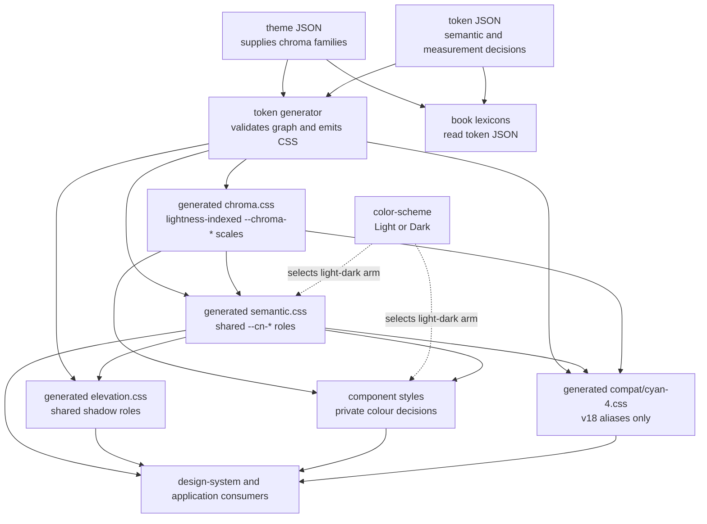
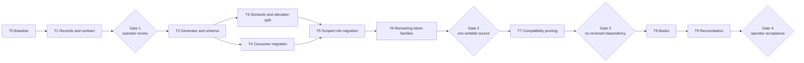

# Colour Token Regression Repair Plan

- **Status:** proposed
- **Authority:** [ADR 0002](adrs/0002-preserve-v20-design-system-names.md)
- **Defect record:**
  [`plans/debt/token-layer-collapse.md`](../plans/debt/token-layer-collapse.md)

## Purpose

Restore the colour-token boundary carried by the v20 implementation after v21 placed
the chroma scales in the semantic token namespace. The repair aligns the design
guidance, specifications, stylesheets, verification, and books without changing the
rendered Light or Dark appearance.

This document coordinates the repair. It introduces no design decision. ADR 0002
already preserves `--chroma-*` as the permanent palette exception to the public
`--cn-*` namespace.

## Regression

Replaceable chroma imports predate Pelilauta and exist in Cyan 1. V19 supplies the
current vocabulary for the chromatic and semantic layers, together with the accepted
use of OKLCH lightness as an approximation for contrast. V20 carries that model in
the design-system implementation being ported. It separates the theme-supplied scales
from the roles that consume them:

- `--chroma-*` names replaceable lightness-indexed palettes. A theme may replace a
  family while preserving its steps. The model accepts OKLCH lightness as an
  approximation of WCAG contrast rather than making exact contrast a substitution
  requirement.
- `--cn-*` and documented `--cn-color-*` names state semantic roles.
- Components consume semantic roles unless an approved decorative use needs a
  palette step.

V21 copied the palette values into `color-reference.css` as
`--cn-color-{family}-{step}`. This makes `--cn-color-warning-40` a reference value
and `--cn-color-warning` a semantic role. `compat/cyan-4.css` then defines
`--chroma-*` as aliases to the renamed palette, reversing the permanent dependency.

The implementation caused two record regressions:

- `docs/ARCHITECTURE.md` forbids the `--chroma-*` vocabulary that ADR 0002
  preserves.
- `specs/design-system/design-tokens/spec.md` classifies that vocabulary as Cyan 4
  compatibility scheduled for removal.

The colour books publish the implemented namespace and therefore reproduce the
regression.

## Target architecture

The writable sources and generated files carry these responsibilities:

| File | Contents | Excludes |
| :--- | :--- | :--- |
| `tokens/themes/default.json` | The default theme's literal v20 OKLCH scales, grouped as complete lightness-indexed chroma families. | Semantic purpose, CSS syntax, compatibility aliases. |
| `tokens/semantic-color.json` | Shared colour roles, symbolic chroma references, and Light and Dark mappings. | Literal palette values, shadow geometry, one-component values. |
| `tokens/elevation.json` | Shared shadow colour and grid-derived shadow roles. | Component shadows. |
| `tokens/units.json` and `tokens/typography.json` | Public measurement and type decisions now duplicated between CSS and books. | Component-private values. |
| `tokens/compatibility/cyan-4.json` | Names required by remaining Cyan 4 consumers and their permanent targets. | Permanent token declarations. |
| `scripts/generate-tokens.mjs` | Schema and dependency validation; deterministic CSS emission. | Design rationale and handwritten token values. |
| Generated `styles/chroma.css` | The active theme's `--chroma-*` declarations. | Hand edits. |
| Generated `styles/semantic.css` | Shared `--cn-*` colour declarations. | Hand edits. |
| Generated `styles/elevation.css` | Shared shadow declarations. | Hand edits. |
| Component stylesheet | Private colour decisions and approved decorative palette use. | Public tokens without a second capability. |
| Generated `styles/compat/cyan-4.css` | Names required by remaining Cyan 4 consumers. | Permanent palette declarations and aliases used only by migrated code. |
| `styles/color.css` | Imports the colour layers in dependency order. | Token declarations. |
| `styles/tokens.css` | Composes units, colour, and elevation dependencies. | Layer implementation. |

`preflight.css`, `CnThemeSwitch`, and each application's preference restoration keep
their current responsibility for `color-scheme`. The repair changes no theme
selection or persistence behaviour.

## Delivery invariants

- Every computed production colour remains the same in Light and Dark throughout
  the repair.
- The OKLCH values and tonal steps remain unchanged.
- A replacement theme may supply a complete chroma family without changing a
  semantic or component token. Each supplied family preserves the OKLCH lightness
  steps.
- Token JSON is the only writable source for every public global token. Generated
  CSS is committed and a check fails when it differs from its source.
- Books read token JSON rather than reparsing generated CSS. They contain no copied
  token inventory.
- Each landed step leaves every required custom-property reference resolvable.
- Remaining Cyan 4 consumers continue to receive their existing names until their
  surface migrates.
- A compatibility alias depends on a permanent token. A permanent token never
  depends on compatibility vocabulary.
- A reference token contains a literal value and depends on no token.
- A semantic colour depends only on chroma or another semantic token.
- A value with one design-system capability remains private unless its specification
  defines a supported customization surface.
- Components use palette steps only for a documented decorative expression that
  carries no semantic state.
- Application behaviour, persisted theme preference, public URLs, and shared data
  remain unchanged.
- Verification does not run the Pelilauta application e2e suite or release UAT.

## Scope inventory

The implementation pass must classify every declaration in the current
`color-theme.css` before moving it:

| Current family | Expected destination | Required check |
| :--- | :--- | :--- |
| Surface, foreground, text, link, border, state, selection, scrim, backdrop, and status roles | `semantic.css` | At least two capabilities consume the role, or a governing spec defines it as shared. |
| Shadow colour and elevation shadows | `elevation.css` | Surface and action contracts retain their geometry and contrast. |
| Bubble, reply, input, lightbox, loader, and avatar roles | Component scope or `semantic.css` | Production and compatibility consumers establish reach; a public customization contract also establishes reach. |
| Direct numbered palette references in components and styles | Semantic role, private expression, or approved `--chroma-*` decoration | The governing spec states the intended category. |
| Cyan `--color-*`, `--background-*`, and genuinely legacy `--cn-*` names | `compat/cyan-4.css` | A remaining Cyan consumer requires each alias. |

The direct numbered-palette inventory currently reaches these production surfaces:

- `CnCard`, `CnReactionButton`, and `CnThemeSwitch`.
- Chip, chrome action, poster, toggle, and button presentation.
- Pelilauta's colour-theme contract and focused colour-theme browser check.
- Design-site checks for Chip, Loader, and Reaction Button.

The inventory must be repeated immediately before implementation because the active
thread-presentation work also changes Reaction Button files.

## Work plan

### T0 — Freeze the baseline and classify the vocabulary

**Depends on:** the current thread-presentation work no longer editing shared files.

1. Record the current computed values of every semantic role in forced Light and
   Dark schemes.
2. Enumerate every numbered `--cn-color-{family}-{step}` reference outside the
   reference and semantic source files.
3. Enumerate every `--chroma-*`, `--color-*`, `--background-*`, and deprecated
   `--cn-*` compatibility declaration with its remaining consumer.
4. Classify each current `color-theme.css` declaration as shared semantic,
   elevation, component-private, or compatibility-only.
5. Identify public component tokens whose live specification intentionally
   exposes customization. Do not make those private through a consumer-count rule.

**Completion evidence:** a token disposition table in the implementation change or
its review record accounts for every declaration and alias. No token remains
unclassified.

### T1 — Correct the governing records

**Depends on:** T0.

1. Add the colour foundation to `docs/DESIGN.md`: replaceable chroma imports predate
   Pelilauta and exist in Cyan 1; v19 supplies the present chromatic and semantic
   vocabulary and OKLCH-lightness approximation; v20 carries the implementation being
   ported. State that semantics preserve purpose across schemes and components consume
   purpose.
2. Correct the token naming table and rules in `docs/ARCHITECTURE.md` to match ADR
   0002. Add a Mermaid dependency diagram only if it carries a relationship the
   naming table does not show.
3. Return `specs/design-system/design-tokens/spec.md` to proposed and restore chroma as
   the permanent theme input layer. Define the allowed dependencies, complete-family
   substitution and lightness-step guarantees, source-driven lexicons, and
   compatibility boundary.
4. Amend `specs/design-system/surface/spec.md` only if moving elevation declarations
   changes its named dependency.
5. Amend component or base specifications only where T0 changes a named public token,
   a declared customization surface, or an approved direct palette use. At minimum,
   inspect Actions, CnCard, CnLoader, CnReactionButton, Identity Mark, and CnBubble.
6. Put one dependency Mermaid in the Design Tokens Architecture section. Keep token
   values and behavioural acceptance in their existing tables and scenarios.

**Gate 1:** the operator confirms that the records express the already-decided v20
model and sets the changed specifications live by reading them before token
implementation.

### T2 — Establish the token schema, generator, and canonical chroma

**Depends on:** Gate 1.

1. Define a JSON schema for stable token identifiers, emitted CSS names, token kind,
   literal or symbolic value, Light and Dark arms, and lexicon group.
2. Represent token dependencies with symbolic identifiers rather than embedded
   `var()` strings.
3. Make the generator reject duplicate CSS names, missing references, cycles,
   incomplete mode mappings, illegal layer dependencies, and incomplete theme
   families.
4. Generate deterministic, committed CSS with a header that directs edits to JSON.
   Add `generate:tokens` and `check:tokens` package commands.
5. Add `tokens/themes/default.json` with the unchanged OKLCH values under their v20
   `--chroma-*` names. Validate family completeness and step lightness.
6. Generate `styles/chroma.css` and change semantic definitions to read canonical
   chroma.
7. Remove the reverse `--chroma-*` aliases from Cyan compatibility; preserve Cyan's
   exceptional `--chroma-K-S` and `--chroma-S-K` aliases only when current consumers
   require them.
8. Retain temporary aliases for the accidental numbered `--cn-color-*` vocabulary
   while direct consumers migrate. Keep those aliases outside the permanent
   semantic layer and mark their removal task in the same changeset.
9. Replace stylesheet-parity assertions with schema, graph, generation, and theme
   contract checks. Keep browser checks for the generated cascade.

**Completion evidence:** semantic values resolve identically to the T0 baseline;
both migrated and not-yet-migrated consumers resolve during the bridge; a hand edit
to generated CSS makes `check:tokens` fail.

### T3 — Separate semantic colour from elevation geometry

**Depends on:** T2.

1. Move shared colour-role data into `tokens/semantic-color.json` and generate
   `semantic.css` in place of `color-theme.css`.
2. Move shared shadow data into `tokens/elevation.json` and generate
   `elevation.css`.
3. Update `color.css` and `tokens.css` so units precede elevation and every entry
   point supplies its declared dependencies.
4. Update package tests that name the former files. Remove CSS parsing used only to
   keep a copied inventory aligned.
5. Remove implementation rationale from the token table when its governing spec or
   test carries the decision. Retain short disambiguating comments beside values
   that otherwise look interchangeable.

**Completion evidence:** import-order tests establish `chroma → semantic` and
`units + semantic → elevation`; semantic literal and duplicate-declaration checks
pass.

### T4 — Migrate direct palette consumers

**Depends on:** T2. This task may run alongside T3 when file ownership does not
overlap.

For each numbered `--cn-color-*` use:

1. Replace semantic use with an existing semantic role.
2. Introduce a shared role only when two capabilities require the same purpose.
3. Keep an approved decorative use as a direct `--chroma-*` reference and state the
   exception in its governing specification.
4. Keep a one-component expression local to that component.
5. Update its focused component or browser check in the same change.

Partition implementation by non-overlapping surfaces:

- Card and poster decoration.
- Reaction Button, Chip, Toggle, and action-state presentation.
- Theme Switch decoration.
- Chrome action presentation.
- Pelilauta theme contract after the package vocabulary settles.

**Completion evidence:** no production or design-site consumer uses a numbered
`--cn-color-*` reference.

### T5 — Move scoped roles to their correct carrier

**Depends on:** T3 and T4.

Use T0's classification for Bubble and Reply, Input, Lightbox, Loader, and Identity
Mark token families:

1. Keep a role in `semantic.css` when multiple current capabilities consume its
   purpose.
2. Move a supported component customization token to the component's global token
   stylesheet and retain its public `--cn-*` name.
3. Move a private value to the component scope and use a private name.
4. Let a Cyan compatibility alias derive from permanent chroma or semantics. Do not
   keep an otherwise-unused public role solely to shorten an alias expression.
5. Update the governing component spec and focused test with each material public
   boundary correction.

The task is divisible by token family after `semantic.css` has one assigned editor.

**Completion evidence:** every public token has either two current capability
consumers or an explicit customization contract; no component-private token is
declared on `:root`.

### T6 — Move the remaining public token families to generated sources

**Depends on:** T5.

1. Move units and typography values into their JSON sources without changing their
   generated declarations.
2. Classify public component measurement tokens by the same shared-use and supported
   customization rules used for colour.
3. Generate the existing CSS entry files so application imports do not change.
4. Remove tests that compare two writable inventories. Retain behavioural,
   mathematical, Cyan parity, and browser checks.

**Gate 2:** every public global token has one writable JSON source, generated CSS is
current, and books can consume the source structure without a CSS declaration parser.

### T7 — Remove the compatibility bridge

**Depends on:** Gate 2.

1. Remove every temporary numbered `--cn-color-{family}-{step}` alias.
2. Remove `color-reference.css` after no import, parser, test, book, or consumer names
   it.
3. Move retained Cyan aliases into `tokens/compatibility/cyan-4.json`, generate the
   stylesheet, and prune it against remaining Cyan package and application usage.
4. Assert that permanent sources do not read `--color-*`, `--background-*`, or other
   compatibility names.
5. Assert that compatibility aliases terminate in chroma or semantic roles and do
   not form a cycle.

**Gate 3:** repository search finds no accidental numbered `--cn-color-*` vocabulary,
and the dependency checks find no permanent-to-compatibility edge.

### T8 — Rebuild the books from token sources

**Depends on:** Gate 3.

1. Change the Colour principles book to publish chroma as the theme-supplied,
   lightness-indexed layer and semantics as the stable component-facing layer.
2. Change token lexicons to read JSON directly. Generate no book prose or design
   rationale.
3. Update colour resolution and contrast specimens to use the token graph rather
   than parse generated CSS.
4. Update component books whose token tables or prose name a moved role. At minimum,
   inspect CnAvatar, CnLoader, CnReactionButton, Identity Mark, Icon, Surface, and
   Units.
5. Add a diagram only where it explains a dependency or scheme-selection flow more
   clearly than the principles prose. Use a design-site-supported specimen if MDX
   does not render Mermaid; do not ship an unrendered Mermaid fence.

**Completion evidence:** the source-driven lexicons list all and only the declarations
in their source; Light and Dark specimens retain the T0 appearance.

### T9 — Reconcile and verify the repair

**Depends on:** T8.

1. Reconcile implementation with every changed specification.
2. Run the design-system package tests.
3. Run Pelilauta's unit and style-contract tests.
4. Run `astro check` for both applications.
5. Run the design site's focused colour, surface, theme, and affected-component
   Playwright checks in Light and Dark.
6. Run the design site's full browser suite when focused checks pass.
7. Review the Colour, Surface, and affected component books in both schemes.
8. Search for old filenames and accidental vocabulary across code, prose, tests, and
   closed migration records. Historical records may retain a name when the text
   clearly describes the former state.
9. Delete `plans/debt/token-layer-collapse.md` when the code and records no longer
   contain the defect.

Do not run the Pelilauta e2e suite or `pnpm test:uat` during implementation. Release
acceptance retains its existing delivery-review timing.

**Gate 4:** the operator reviews the rendered books and approves any specification
returned to proposed. The repair is complete when all automated checks pass and no
current source presents the collapsed namespace as permanent.

## Verification matrix

| Guarantee | Detector |
| :--- | :--- |
| Chroma families are literal, complete, and preserve their OKLCH lightness steps. | Token schema and theme-contract tests. |
| Permanent dependencies point upward from chroma only. | Token-graph validation. |
| Generated CSS matches the writable source. | Deterministic `check:tokens`. |
| All required custom properties resolve. | Package-wide token resolvability test. |
| Light and Dark semantic values match the baseline. | Source resolver tests and design-site browser checks. |
| The shipped default theme retains its currently tested contrast outcomes. | Colour contrast unit tests. |
| Surface and elevation remain unchanged. | Surface unit and design-site browser checks. |
| Theme selection and restoration remain unchanged. | CnThemeSwitch and design-site-theme browser checks; Pelilauta style contract. |
| Books publish their source without copied inventories. | JSON lexicon tests and Astro checks. |
| Cyan compatibility remains available. | Pelilauta unit/style tests and focused migrated-surface checks. |
| Old accidental vocabulary is gone. | Repository search and token-contract denylist. |

## Parallel work boundaries

Parallel tasks must not edit the same shared carriers:

- Assign one editor to the schema, generator, shared token JSON, generated entry
  points, and token-graph tests.
- Partition component migrations by component and stylesheet.
- Partition book work by principles/token lexicons and component books only after
  source filenames and token disposition settle.
- Keep `docs/DESIGN.md`, `docs/ARCHITECTURE.md`, and the Design Tokens spec with one
  editor so their vocabulary cannot diverge during review.
- Run one integration pass after every parallel wave; shared filesystem visibility
  is not integration.

T0, T1, T2, T6, T7, and T9 are serial gates. T3 and T4 can overlap after canonical
chroma exists. T5 families can run in parallel. T8 books can run in parallel after
the token source layout is final.

## Size

Treat the repair as a large refactor with three review gates, not as a token rename.
The current inventory indicates:

- 10 top-level tasks, 12–14 independently reviewable work packages, and operator
  gates.
- About 45–65 touched files across records, specifications, token data, generation,
  styles, components,
  tests, book tooling, books, and the Pelilauta style contract.
- Three safe parallel waves after the records, generator, and compatibility bridge
  settle.
- One dedicated integration and visual-review pass after mechanical migration.

The estimate excludes new palette design, application redesign, Cyan surface
migration, and forced-colours support.

## Failure recovery

Every implementation task must leave the compatibility bridge resolvable. If a wave
changes computed output, revert that wave's scoped files while retaining the last
passing canonical chroma and aliases. Do not restore the reversed dependency from
permanent chroma to accidental v21 names.

The repair changes CSS source and records only. It requires no data rollback,
deployment change, or Firebase coordination.
