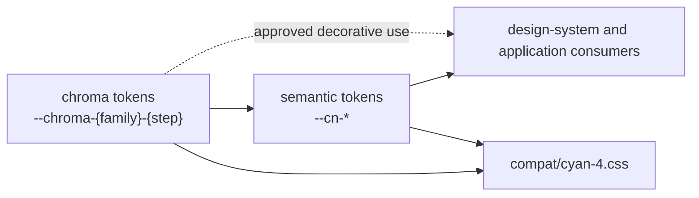

# Design Tokens

## Blueprint

### Context

Design tokens carry recurring visual decisions across the design system and both
applications. Chroma tokens define the available palette; semantic tokens name its
purpose. Consumers depend on that purpose, allowing a visual expression to change
without changing the meaning of every use.

### Architecture

The permanent model runs in one direction:

1. The **chroma layer** declares literal, lightness-indexed palette values under
   `--chroma-{family}-{step}`. It is the theme's replaceable input for its core
   families.
2. The **semantic layer** assigns roles under `--cn-*`. A theme-dependent role
   expresses Light and Dark as two arms of one declaration; a theme-invariant role
   uses one expression.
3. **Consumers** read semantic roles according to purpose. An approved decorative
   use may reference a chroma step directly when its governing component
   specification states the exception.



Two core chroma families, primary and surface, are complete 13-step (0–100)
lightness-indexed scales and the only replaceable theme surface: a replacement
theme supplies a complete family, preserving the OKLCH lightness step of every
index it carries. Three auxiliary families, love, warning and error, are partial
20/40/60/90 scales and not themeable. No info family or role exists.

Surface consumes background and shadow roles to form elevation levels as defined
by `specs/design-system/surface/spec.md`. Components compose those levels where
required; they do not reconstruct the elevation token mapping.

The grid family is independent of colour. Semantic shadow declarations derive
from the grid, so the token entry point composes both families and supplies every
dependency together.

Cyan 4 compatibility aliases are outside the permanent model. They keep legacy
consumers testable while migration is incomplete. `compat/cyan-4.css` carries only
the names its remaining Cyan consumers require. An alias is added when a
remaining legacy consumer requires it and terminates in a chroma or semantic
token. The aliases are removed before `v21.0.0-rc.1`.

### Constraints

A token represents a reviewed decision shared by current consumers. One-off
component values do not require tokens, and a possible future consumer does not
justify a token family.

Tokens remain inputs to CSS calculations. Consumers compose final measurements
from them instead of storing precomputed results that would stop responding when
an input changes.

The grid uses `rem`, the design system sets no root text size, and every breakpoint
uses `rem`. Spacing and query thresholds therefore follow the reader's default
text size.

Semantic colour roles preserve purpose, hierarchy, interaction states, and
readable contrast in Light and Dark. A consumer uses a semantic role where the
system has named that purpose; it does not select a chroma step as a local
substitute for an unnamed purpose.

Token JSON is the single writable source for chroma, semantic, and compatibility
declarations. Generated CSS is committed, and a check fails when it differs from
its source. A book reads token JSON; it does not reparse generated CSS.

Compatibility aliases receive no lexicon and no new consumer. They are migration
scaffolding, not an alternative public vocabulary or a completeness contract.
They receive no dedicated compatibility test.

## Contract

### Definition of Done

- A new token family has a named production use and is documented by the book
  that carries its design intent.
- A source-driven lexicon lists all and only the declarations in its token JSON
  source. A selection matching no token fails the build.
- Human review accepts the hierarchy, states, and contrast produced by semantic
  roles in Light and Dark.

### Regression Guardrails

- A chroma token is literal and depends on nothing. A semantic colour token
  depends only on chroma or another semantic token. A compatibility alias
  depends on a permanent token; no permanent token depends on compatibility
  vocabulary.
- A replacement theme supplies a complete primary or surface family without
  changing a semantic or component token, preserving the OKLCH lightness step of
  every index it carries. The auxiliary families are not a themeable surface.
- The token entry point supplies the grid dependency required by semantic shadow
  declarations.
- No design-system stylesheet sets the root text size or uses a pixel breakpoint.
- The compatibility vocabulary does not appear in a lexicon and is removed before
  `v21.0.0-rc.1`.

### Scenarios

```gherkin
Given a semantic colour role used by a component
When the active colour scheme changes between Light and Dark
Then the role resolves to the expression for that scheme
And its purpose in the component does not change
```

```gherkin
Given a reader who enlarges the browser's default text size
When a rem-based design-system measurement or breakpoint is evaluated
Then its rem-based value scales with that preference
```
