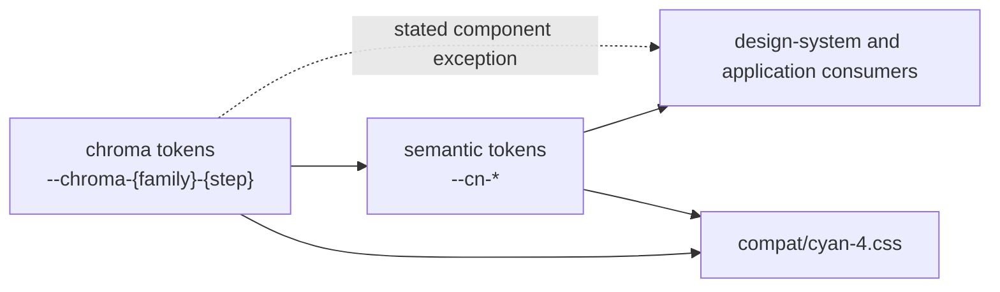

# Design Tokens

## Blueprint

### Context

Design tokens carry recurring visual decisions across the design system and both
applications. This capability defines the token mechanism — sources, naming,
dependencies, and generation. What the colour tokens mean is defined by
`specs/design-system/color-system/spec.md`; the measurements by
`specs/design-system/spatial-system/spec.md`.

### Architecture

The permanent model runs in one direction:

1. The **chroma layer** declares literal palette values under
   `--chroma-{family}-{step}` (ADR 0002).
2. The **semantic layer** assigns roles under `--cn-*`.
3. **Consumers** read semantic roles;
   `specs/design-system/color-system/spec.md` defines the direct-chroma
   exception.



Semantic shadow declarations derive from the grid, so the token entry point
composes the measurement and colour families and supplies every dependency
together.

Cyan 4 compatibility aliases are outside the permanent model. They keep legacy
consumers testable while migration is incomplete. `compat/cyan-4.css` carries
only the names its remaining Cyan consumers require. An alias is added when a
remaining legacy consumer requires it and terminates in a chroma or semantic
token.

### Constraints

A token represents a reviewed decision shared by current consumers. One-off
component values do not require tokens. A possible future consumer does not
justify a token family.

Tokens remain inputs to CSS calculations. Consumers compose final measurements
from them instead of storing precomputed results that would stop responding when
an input changes.

Token JSON is the single writable source for every public global token.
Generated CSS is committed, and a check fails when it differs from
its source. A book reads token JSON; it does not reparse generated CSS.

Compatibility aliases receive no lexicon and no new consumer. They are migration
scaffolding, not an alternative public vocabulary or a completeness contract.
They receive no dedicated compatibility test.

## Contract

### Definition of Done

- A new token family has a named production use and is documented by the book
  that carries its design intent.
- A source-driven lexicon lists all and only the declarations in its token JSON
  source. A selection matching no token fails the build.

### Regression Guardrails

- A chroma token is literal and depends on nothing. A semantic token depends
  only on chroma or another semantic token. A compatibility alias depends on a
  permanent token; no permanent token depends on compatibility vocabulary.
- The accidental numbered `--cn-color-{family}-{step}` vocabulary is removed
  before `v21.0.0-rc.1`. A retained compatibility alias is removed when its
  last Cyan consumer migrates.

### Scenarios

```gherkin
Given a hand edit to a generated token stylesheet
When the token check runs
Then it fails and names the JSON source as the writable carrier
```
