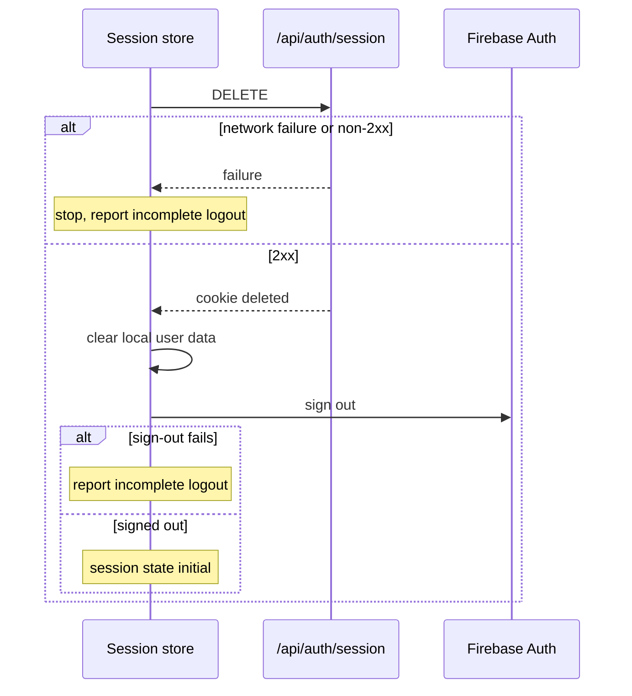

# Session

## Blueprint

### Context

Readers require the browser interface and server requests to share the same account.
Temporary verification failures do not force readers to sign in again.

Readers often use shared computers. After a completed logout, the device neither
displays the reader's data nor acts under the reader's account.

### Architecture

Firebase client authentication supplies credentials for browser Firestore access.
The Firebase Admin SDK verifies the `session` cookie for server requests.
`@pelilauta/stores/session` reconciles these identities through
`/api/auth/session`. Server agreement follows either verification of a cookie for
the resolved Firebase user or acknowledged cookie creation from the verified ID
token for that user. Agreement establishes neither client data readiness nor
resource access permissions.

`@pelilauta/utils/server/auth/verifySession` carries shared cookie verification.
Status checks distinguish rejected credentials from unavailable verification.
Protected routes retain existing guards, including
`@pelilauta/base/utils/requireSession`.

The optional [service worker](../../../apps/pelilauta/public/service-worker.js)
intercepts API traffic and participates in cache and replay exclusions for the
session endpoint.

[Login](../login/spec.md) governs sign-in presentation and return destinations.
[Settings](../library/settings/spec.md) governs account controls.

#### Server-rendering boundary

Server rendering derives identity from cookie verification and passes only
identity data required by an island. Identity remains scoped to the request and
never populates module-level stores. Server identity establishes neither a
Firebase user nor authenticated client reads. Personalized responses remain
outside shared and offline caches.

Route guards retain authorization decisions; pathname-prefix middleware does not
replace them. The architecture retains Firebase cookies and browser
authentication. The contract excludes migration to
[Astro sessions](https://docs.astro.build/en/guides/sessions/) and excludes
moving browser Firestore access to server APIs.

### Constraints

The contract governs verified session status, reconciliation between server
and browser identities, and logout. Extending SSR identity initialization
requires a separate decision. The specification preserves cookie lifetimes,
client persistence, renewal triggers, and protected-page authorization semantics.

The [session endpoint](../../../apps/pelilauta/src/pages/api/auth/session.ts)
defines cookie lifetime and attributes. The [session store](../../../apps/pelilauta/src/stores/session/index.ts)
recreates the cookie from persistent Firebase authentication without recent
interactive sign-in. Cookie expiry does not define a maximum
login duration. Returning `expiresAt` introduces no renewal timer or threshold.

This specification introduces no new protected-page recovery flow.

### Status protocol

`GET /api/auth/session` verifies the cookie with revocation checking before
returning identity. The endpoint performs no cookie creation, renewal, or deletion.

| Verification result | Response |
| :--- | :--- |
| The cookie verifies. | The endpoint returns HTTP 200 with JSON containing only `uid` and `expiresAt`. `uid` carries the verified UID, and `expiresAt` carries the verified `exp` claim in Unix seconds. |
| The cookie is absent, expired, invalid, or revoked, or the account is disabled or deleted. | The endpoint returns HTTP 401 without identity data. |
| A verification dependency is unavailable. | The endpoint returns HTTP 503 without identity data. |
| Verification encounters an unclassified server error. | The endpoint returns HTTP 500 without identity data. |

Every GET response carries `Cache-Control: no-store`. Only recognized credential
failures map to HTTP 401. Recognized dependency transport failures, timeouts,
and service-unavailability errors map to HTTP 503. Responses expose no tokens,
cookie values, additional claims, or verifier error details.

### Reconciliation

When checking server session status, the browser compares the returned UID
with the resolved Firebase user UID. Matching UIDs establish server agreement
without a POST request. When the UID mismatches or the endpoint returns HTTP 401,
the browser exchanges the resolved user ID token through POST `/api/auth/session`
before confirming agreement. An HTTP 200 response to that POST acknowledges
cookie creation and establishes agreement without a second GET.

A failed repair POST leaves agreement unconfirmed and produces no active session.
A transport failure or HTTP 5xx response preserves Firebase authentication and
permits a later repair attempt. An HTTP 401 response denotes credential
rejection.

A GET network failure, a server error, or a malformed success body leaves
agreement unconfirmed and permits a later check. Inconclusive checks trigger
neither speculative cookie creation nor Firebase sign-out. A valid success body
requires a non-empty string `uid` and a finite integer `expiresAt`.

### Logout

Reconciliation rebuilds the session cookie and local user data from the Firebase
session; a cookie never restores Firebase authentication. Logout removes the
session cookie first, local user data second, and the Firebase session last.
Local user data covers the persisted UID, the persisted subscriber data, and the
account and profile subscriptions.



If a step fails, logout stops and leaves the later steps undone. Firebase keeps
the session, so a later page load can repair or remove the cookie. A failed step
sets the session state to `error` and tells the reader that logout did not
complete. The notice survives a redirect. A completed logout sets the session
state to `initial`. A retry runs every step again. A caller that invokes logout
while one is in progress awaits that operation and receives its outcome.

When Firebase resolves no user, the session store calls logout only if the
session state is not `initial`. When an incomplete logout leaves the Firebase
session intact, the next page load runs reconciliation, which can restore the
session.

The contract excludes ordering against in-flight cookie creation and excludes
session revocation on other devices.

## Contract

### Definition of Done

- A status check identifies the verified cookie user and expiry without exposing
  credentials.
- Reconciliation distinguishes matching identities, credentials requiring repair,
  and incomplete verification.
- Reconciliation preserves a matching cookie without a replacement POST.
- Missing or mismatched credentials require successful repair before the browser
  accepts server agreement.
- A temporary repair failure preserves Firebase authentication for a later attempt.
- Logout removes the session cookie, local user data, and the Firebase session, in
  that order, from every session state.
- A failed logout step leaves later steps undone and notifies the reader that
  logout did not complete.

### Regression Guardrails

- Persisted UID and session-state values do not substitute for status responses
  during reconciliation.
- A cookie response never supplies the UID for browser Firebase authentication.
- Session status never comes from a service-worker cache, including an entry saved
  before the status protocol changed. Exclude `/api/auth/session` from
  service-worker cache reads and writes.
- The service worker never queues or replays session mutations.
- Protected-page verification returns `null` for every verifier error.
  `requireSession` redirects to login when verification returns `null`, including
  during a verification outage. Other page guards retain their redirects and
  denials.

### Scenarios

```gherkin
Feature: Verified session agreement

  Scenario: Return verified identity
    Given a valid session cookie for account A with expiry E
    When the browser requests session status
    Then the endpoint checks revocation
    And the endpoint returns HTTP 200 with exactly {"uid":"A","expiresAt":E}
    And E is the cookie expiry in Unix seconds
    And the response carries Cache-Control: no-store

  Scenario Outline: Reject unusable credentials
    Given <credentials>
    When the browser requests session status
    Then the endpoint returns HTTP 401 without identity data
    And the response carries Cache-Control: no-store

    Examples:
      | credentials                         |
      | no session cookie                   |
      | an expired session cookie           |
      | an invalid session cookie           |
      | a revoked session cookie            |
      | a cookie for a disabled account     |
      | a cookie for a deleted account      |

  Scenario: Keep a matching cookie
    Given Firebase has resolved account A
    When session status returns a valid success body for account A
    Then reconciliation accepts server agreement
    And reconciliation sends no session POST

  Scenario Outline: Repair a cookie before accepting agreement
    Given Firebase has resolved account A
    When session status returns <result>
    Then reconciliation posts the ID token for account A through the existing session endpoint
    And agreement remains unconfirmed until that POST succeeds
    When the POST returns HTTP 200
    Then reconciliation accepts server agreement without a second GET

    Examples:
      | result                                |
      | HTTP 401                              |
      | a valid success body for account B    |

  Scenario Outline: Keep failed repair out of the active session
    Given Firebase has resolved account A
    And the server cookie requires repair
    When the repair POST encounters <failure>
    Then server agreement remains unconfirmed
    And reconciliation does not confirm an active session

    Examples:
      | failure            |
      | HTTP 401           |
      | HTTP 500           |
      | HTTP 503           |
      | a network failure  |

  Scenario Outline: Preserve Firebase authentication after a temporary repair failure
    Given Firebase has resolved account A
    When the repair POST encounters <failure>
    Then reconciliation retains Firebase authentication for account A
    And a later repair attempt remains possible

    Examples:
      | failure            |
      | HTTP 500           |
      | HTTP 503           |
      | a network failure  |

  Scenario Outline: Distinguish dependency outages from unclassified server errors
    Given verification encounters <failure>
    When the browser requests session status
    Then the endpoint returns <status> without identity data
    And the response carries Cache-Control: no-store

    Examples:
      | failure                                  | status   |
      | a recognized dependency timeout          | HTTP 503 |
      | a recognized dependency transport error  | HTTP 503 |
      | a recognized service-unavailability error | HTTP 503 |
      | an unclassified server error             | HTTP 500 |

  Scenario Outline: Preserve authentication after an inconclusive status check
    Given Firebase has resolved account A
    When the session check encounters <failure>
    Then reconciliation accepts no server agreement
    And reconciliation sends no session POST
    And reconciliation retains Firebase authentication for account A

    Examples:
      | failure                    |
      | a network failure          |
      | HTTP 503                   |
      | HTTP 500                   |
      | a malformed success body   |

  Scenario: Recover from an inconclusive status check
    Given an earlier status check left agreement unconfirmed
    And Firebase authentication for account A remains available
    When a later check returns a valid success body for account A
    Then reconciliation accepts server agreement

  Scenario: Recover from a temporary repair failure
    Given an earlier repair POST failed temporarily
    And Firebase authentication for account A remains available
    When a later repair POST for account A returns HTTP 200
    Then reconciliation accepts server agreement without another Firebase sign-in

  Scenario: Refuse cached identity during an outage
    Given a service worker has a cached successful session-status response
    And the network is unavailable
    When the browser checks session status
    Then the cached response does not establish server agreement

  Scenario: Do not queue session creation for background replay
    Given a service worker controls the page
    When a session POST fails because the network is unavailable
    Then the worker stores no session request for background replay
    When connectivity returns after the reader signs out
    Then the worker does not replay that session POST

  Scenario Outline: Log out from any session state
    Given the session state is <state>
    When logout is called and every step succeeds
    Then the store deletes the session cookie before clearing local user data
    And the store clears local user data before Firebase signs out
    And the session state becomes initial

    Examples:
      | state   |
      | initial |
      | loading |
      | active  |
      | error   |

  Scenario Outline: Keep the Firebase session when the cookie deletion fails
    Given account A is signed in
    When logout is called and the cookie DELETE meets <failure>
    Then local user data remains
    And Firebase keeps account A signed in
    And the session state is error
    And the store notifies the reader that logout did not complete, including after a redirect

    Examples:
      | failure           |
      | a network failure |
      | HTTP 500          |

  Scenario: Report a failed Firebase sign-out
    Given the store deleted the session cookie and cleared local user data
    When Firebase sign-out fails
    Then the session state is error
    And the store notifies the reader that logout did not complete

  Scenario: Share one logout among concurrent callers
    Given a logout is in progress
    When a second caller calls logout
    Then the second caller awaits the logout in progress
    And each logout step runs once
    And both callers receive the same outcome

  Scenario: Restore the session after an incomplete logout
    Given an earlier logout failed while Firebase kept account A signed in
    When the reader loads a page
    Then reconciliation runs for account A
    And a successful reconciliation sets the session state to active

  Scenario: Leave an anonymous page load alone
    Given the session state is initial
    When Firebase resolves no user
    Then the session store does not call logout
    And no logout step runs

  Scenario Outline: Log out when Firebase has no user
    Given the session state is <state>
    When Firebase resolves no user
    Then the session store calls logout

    Examples:
      | state   |
      | active  |
      | loading |
      | error   |

  Scenario: Retry an incomplete logout
    Given an earlier logout ended with a failed step
    When logout is called again
    Then every logout step runs again
```
